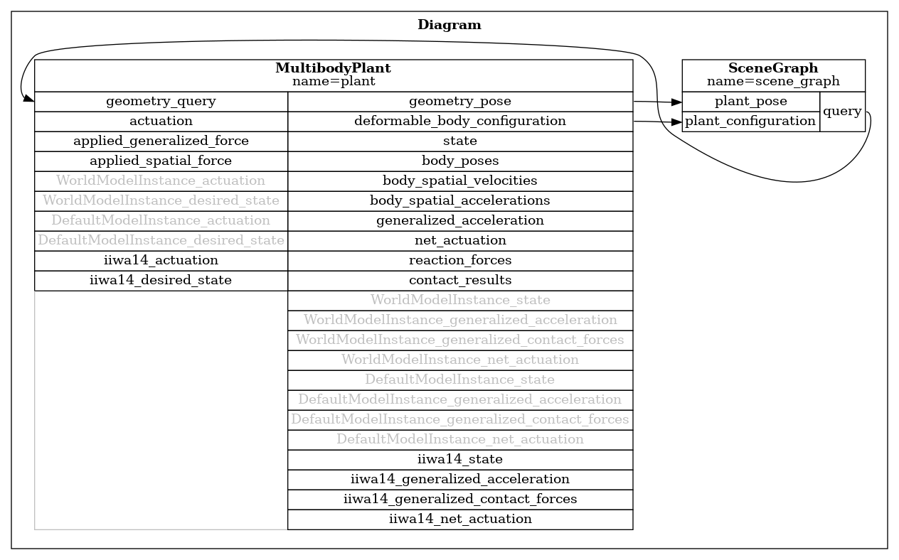
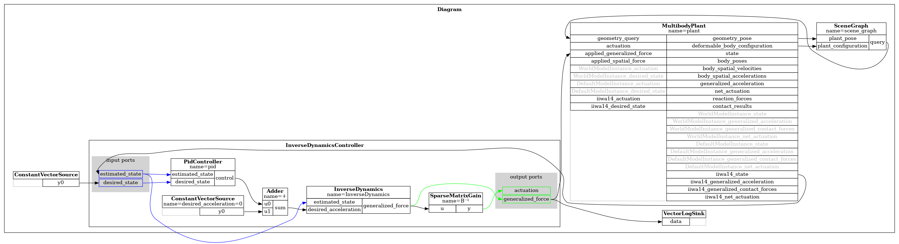
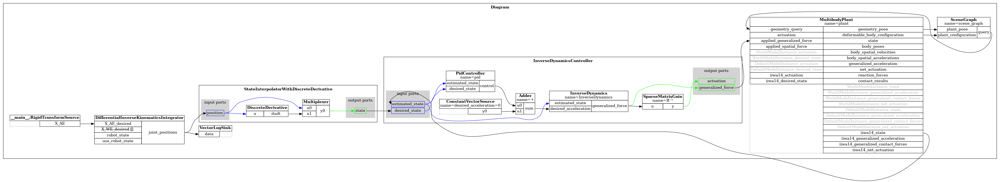

# Drake quick start
This README.md will give you a brief introduction about how to use drake to do robot simulation.
## 1. Set up everything
First clone this repo to your local folder:
````bash
git clone git@github.com:Li-WenChang/drake_quickstart.git
````
Next, create a Python virtual environment and install Drake in it:
````bash
cd drake_quickstart
python3 -m venv dexnex_env      # create the python virtual env
source dexnex_env/bin/activate  # activate the env (if python3 does not work, try python)
pip install --upgrade pip       # (Optional but recommended)
pip install drake               # install drake
````

Try to run the script:
````bash
python3 dexnex_parse.py
````

If you run the script and see an error like this:

````bash
ModuleNotFoundError: No module named 'YYYYY'
````

It means a required Python package is missing from your virtual environment.

- If the import statement for 'YYYYY' is not used anywhere in the script, you can safely delete that import line.

- If the package is used in the script, install it by running the following command inside your activated virtual environment:
  ````bash
  pip install YYYYY
  ````
 
After running the script, you should see a message like:
```` rust
INFO:drake:Meshcat listening for connections at http://localhost:7000
````

Open the provided link in your browser to view Drake's simulation environment. You should see the dexnex robot falling due to the gravity.


## 2. Drake

### 2.1 Parsing robots
1. **Activate your Drake environment**:
   Make sure dexnex_env is active.

2. **Run the script**:
   ````bash
   python3 iiwa_parsing.py
   ````

3. **Access the simulation**:  
   After running the script, you should see a message like:
   ```` rust
   INFO:drake:Meshcat listening for connections at http://localhost:7000
   ````
   
   Open the provided link in your browser to view Drake's simulation environment. You should see a iiwa robot arm falling due to the gravity.
#### Code Explanation
In Drake, we use different systems to do different things. The following line adds two important systems, `MultibodyPlant` and `SceneGraph` into the diagrm. The former handles all the physics (like a physics engine?) and the later handles rendering.

```phtyon
python plant, scene_graph = AddMultibodyPlantSceneGraph(builder, 0.0)
```

Following lines parse a iiwa robot to `MultibodyPlant` and fix the base link to world frame, without this the whole robot will free fall.
```phtyon

iiwa_url = "package://drake_models/iiwa_description/sdf/iiwa14_no_collision.sdf"

# Load the iiwa model
(iiwa,) = parser.AddModels(url=iiwa_url)

plant.WeldFrames(
    frame_on_parent_F=plant.world_frame(),
    frame_on_child_M=plant.GetFrameByName("iiwa_link_0", iiwa),
    X_FM=RigidTransform(RollPitchYaw(np.array([0.0, 0.0, 0.0]) * np.pi / 180), [0.5, 0.5, 0.0])
)
```

Here, I use the iiwa robot as an example. If you have your own robot's URDF, you can parse it by replacing the URL with the path to your URDF file and updating the argument of `GetFrameByName()` to match the base link of your robot.


After running the code, you will see a new file `Parsing_Diagram.png`. This is what the following lines do.

```phtyon
png_data = pydot.graph_from_dot_data(diagram.GetGraphvizString(max_depth=2))[0].create_png()

#Save the PNG to a file
with open("Parsing_Diagram.png", "wb") as f:
    f.write(png_data)

print("Parsing_Diagram.png") 
```
`Parsing_Diagram.png` gives you a clear picture of what's happening inside the simulator.
You might wonder why there are so many systems, even though we only added `MultibodyPlant` and `SceneGraph`.
That's because the following line automatically adds several default visualization systems for you:

```python
AddDefaultVisualization(builder=builder, meshcat=meshcat)
```
If you comment out this line, the diagram will become much simpler.



### 2.2 Controlling Robots (Motion Control)

This section is more interesting because the robot can finally move, and we get to see how Drake is actually used in practice—at least the way *I* use it. One of Drake's core features is its **System Framework**. Instead of writing imperative Python-style logic to control a robot, you build systems (either using Drake's built-in systems or your own custom ones) and wire them together.  


In this section, we introduce three new systems:

- `InverseDynamicsController`: for computing joint torques to achieve a desired motion
- `ConstantVectorSource`: for supplying the desired joint positions and velocities to the controller
- `LogVectorOutput`: for logging data, which is useful for debugging

Only the first two are required for robot control. The third one is optional, but it's a useful system to debug.

#### Why System-Based Design is Preferable in Drake Simulations

When using **Drake** as a simulator, each **System** in the **Diagram** is updated in lockstep with the simulator’s progression. In the script, for example, the simulator steps forward by 1 ms, and during each step:

- The `ConstantVectorSource` outputs a constant vector representing the **desired joint positions**.
- This vector is sent to the `InverseDynamicsController`, which computes the corresponding **joint torques**.
- These torques are applied to the robot in the `MultibodyPlant`.
- Then, the `MultibodyPlant` advances the physics simulation by 1 ms.

This tightly integrated update mechanism is one reason why using **Drake Systems** for data processing is often preferable. If you instead extract data from one system, manually process it in a custom function, and then re-insert it into another system, you would break the continuous flow of the simulation. You’d also need to call `simulator.AdvanceTo(finish_time)` in small chunks, which complicates the simulation loop and defeats the purpose of using Drake’s declarative, system-based design.

But this is just my point of view and this is only true if you use Drake as a simulator. If you simply use Drake as a Inverse Dynamics solver, for example, you don't need to follow this fashion then.


#### Code Explanation

The following code declares two systems: `InverseDynamicsController` and `ConstantVectorSource`, and adds them to the diagram. In Drake terminology, a *diagram* is a meta-system composed of multiple interconnected subsystems.

```python
idc = InverseDynamicsController(plant, 
                                np.ones((U, 1)) * Kp,
                                np.ones((U, 1)) * Ki,
                                np.ones((U, 1)) * Kd,
                                False)
IDC = builder.AddSystem(idc)

joint_command_source = ConstantVectorSource(desired_state)
desired_state_source = builder.AddSystem(joint_command_source)
```
After we add these systems to our diagram, we need to wire them up. Remember that the first argument of `builder.Connect()` is always an **output port** and the second argument is **input port**. Because the set up of `LogVectorOutput` is simpler, the declaration and wiring just need one line of code. 

```phtyon
# set up a logging system, using a system called LogVectorOutput
# and wire it up to the data we want to save, in this case it's the joint torque
torque_logger = LogVectorOutput(IDC.get_output_port_generalized_force(), builder)

# feed joint command to controller
builder.Connect(desired_state_source.get_output_port(), IDC.get_input_port_desired_state())

# send joint torque computed by the controller to robot
builder.Connect(IDC.get_output_port_generalized_force(), plant.get_applied_generalized_force_input_port())

# get feedback from robots
builder.Connect(plant.get_state_output_port(iiwa), IDC.get_input_port_estimated_state())
```
That’s all it takes to set up a basic motion controller! Again, I recommend commenting out the `AddDefaultVisualization` line to generate a cleaner diagram and ensure that what you're doing matches what you think is happening. In next section, I will discuss on how to customize your system.


> **Note:**  
> If your scene includes more than just the robot (e.g., a box that the robot interacts with), you'll need to set up a separate plant—usually called the *controller plant*. In that case, you'll parse only the robot into the controller plant and pass it as the first argument to the `InverseDynamicsController`.  
> For more on why this is necessary, see this helpful Stack Overflow post:  
> [URDF file parsing error in Drake – actuators not being instantiated](https://stackoverflow.com/questions/75917723/urdf-file-parsing-error-in-drake-actuators-not-being-instantiated)  
> Russ Tedrake’s response (he’s the creator of Drake) explains it in detail.  
> There's a Python script named `dexnex_2plant.py` where I demonstrate how to use this *controller plant*. This script was written some time ago and not specifically for this quickstart, so it likely won't run as-is. I recommend using it as a reference to understand how to integrate the controller plant into your own code.


### 2.3 Custom System
The main purpose of this section is to show you how to build a custom system to perform a specific task—since you won’t always find a pre-built Drake system that does exactly what you need. Additionally, I’ll introduce a useful system called `DifferentialInverseKinematicsIntegrator`, which solves inverse kinematics for you. This was actually my first time using it, and it took me over two hours to figure out how to use it properly—so if you’re feeling frustrated with those pre-built systems, you’re definitely not alone.
#### Code Explanation
Let's first take a look at the custom system which is relatively straight forward
```phtyon
class EE_Pose(LeafSystem):
    '''
    this system outputs a desired end-effector pose in the form of transformation matrix
    '''
    def __init__(self):
        super().__init__()

        # Declare a fixed abstract output port with a hardcoded pose
        self.DeclareAbstractOutputPort(
            "X_AE",
            lambda: AbstractValue.Make(RigidTransform()),
            self.CalcOutput
        )

    def CalcOutput(self, context, output):
        time = simulator.get_context().get_time()
        r = 0.4 # radius = 0.3 m
        T = 8  # period
        omega = np.pi*2/T # period = 5 sec
        x = r*np.cos(omega*time + np.pi/2)
        z = np.abs(r*np.sin(omega*time))
        
        pose = RigidTransform(RollPitchYaw(0.0, np.pi/2, 0.0), [x, 0.0, 1.0])
        output.set_value(pose)
```
First, we inherit from LeafSystem, which is the base class for all systems in Drake. In the `__init__` constructor, we define the system’s output ports, input ports, and any other instance variables. In this particular case, we only need to define a single output port.

When declaring an output port, you must specify its type. Drake supports two main types: `AbstractValue` (for arbitrary Python objects like transforms) and vector-valued outputs (for numerical arrays). Here, we use an AbstractValue to output a `RigidTransform`.

To declare the port, we call `DeclareAbstractOutputPort`, providing the name of the port `("X_AE")`, a function that returns a default value `(lambda: AbstractValue.Make(RigidTransform()))`, and a callback `(self.CalcOutput)` that calculates the actual output.

The `CalcOutput` function contains the logic that computes the output at each time step. In this example, we generate a Simple Harmonic Motion trajectory for the end-effector, independent of any input. In fact, this system has no inputs. At the end of this section, I’ll include examples that show how to handle systems with inputs. Keep in mind that the syntax in Drake can be quite complex, so most of the time I use ChatGPT to help generate the class structure, and then I only manually write the `CalcOutput` function to define the specific behavior I need.

Next, we use the `DifferentialInverseKinematicsIntegrator`, a built-in Drake system that continuously solves inverse kinematics (IK) in velocity space and integrates it over time to produce joint positions.
```python
params = DifferentialInverseKinematicsParameters(
    num_positions=plant.num_positions(),
    num_velocities=plant.num_velocities()
)

params.set_time_step(0.01)

params.set_joint_position_limits(
    (plant.GetPositionLowerLimits(),
    plant.GetPositionUpperLimits())
)
params.set_joint_velocity_limits((-1.0 * np.ones(plant.num_velocities()),
                                 1.0 * np.ones(plant.num_velocities())))


# Choose end-effector frame
end_effector_frame = plant.GetFrameByName("iiwa_link_7", iiwa)

base_frame = plant.GetFrameByName("iiwa_link_0", iiwa)


# Add the Diff IK Integrator system
ik_solver = builder.AddSystem(
    DifferentialInverseKinematicsIntegrator(
        plant,
        base_frame,
        end_effector_frame,
        0.01,
        params)
    )
```
The key step is to first create a `DifferentialInverseKinematicsParameters` object, which defines various constraints and limits for the IK solver. One thing to note here is that the `time_step` I set in parameters is the integration time step not the simulator's time step. The rest of the code is relatively self-explanatory

**Diagram:**


**More Custom System example**  
This is a system I use a lot to integrate many data into a one single output.
```python
class Stacker(LeafSystem):
    """Stacks inputs from input ports into a single numeric vector output."""

    def __init__(self):
        super().__init__()
        self.num_robot_state = simulation_plant.num_positions(robot)*2 
        self.num_end_effector_state = 7+6
        self.num_action = simulation_plant.num_positions(robot)
        self.num_goal_pose = 7
        self.num_current_box_pose = 7

        self.total = (self.num_robot_state + 
                        self.num_end_effector_state +
                        self.num_action +
                        self.num_goal_pose +
                        self.num_current_box_pose)

        
        # Declare input ports with different sizes
        self.input_ports = [
            self.DeclareVectorInputPort(f"robot_state", self.num_robot_state),
            self.DeclareVectorInputPort(f"end_effector_state", self.num_end_effector_state),
            self.DeclareVectorInputPort(f"current_pose", self.num_current_box_pose ),
            self.DeclareVectorInputPort(f"goal_pose", self.num_goal_pose ),
            self.DeclareVectorInputPort(f"previous_action", self.num_action)
        ]
        
        # Declare output port
        self.DeclareVectorOutputPort(
            "observation", 
            self.total, 
            self.CalcStackedOutput
        )
    
    def CalcStackedOutput(self, context, output):
        """Concatenates input vectors into a single stacked output vector."""
        stacked_vector = np.hstack([
            self.input_ports[0].Eval(context),
            self.input_ports[1].Eval(context),
            self.input_ports[2].Eval(context),
            self.input_ports[3].Eval(context),
            self.input_ports[4].Eval(context)/np.pi # scale the action back to [-1, 1]
        ])
        output.SetFromVector(stacked_vector)
```


# Appendix
This section is not part of quickstart, I just write how I modify the URDF here.
## A. URDF?
This section covers how to make the URDF of **DexNex** compatible with **Drake**.  
If you're not working on a DexNex-related project, feel free to skip it!

### A.1 What is URDF?
The **Unified Robot Description Format (URDF)** is an XML-based format used to describe a robot's physical and visual properties. At its core, a robot is a collection of **links** (rigid bodies) and **joints** (connections between links), and URDF specifies how these elements are connected.

URDF files define:
- The **type of joints** (e.g., fixed, revolute, prismatic)
- The **shape and appearance** of links (geometry, materials, colors)
- The **structure** of the robot (parent-child relationships)

For **visualization tools** like RViz, a URDF that includes shapes and colors is usually sufficient.

However, for **physics simulation** (e.g., in Drake, MuJoCo or Isaac Sim), you'll also need:
- **Mass**
- **Moments of Inertia (MOI)**
- **Collision geometry**
- **Transmission and actuator info**

These additional properties ensure that the robot behaves realistically in simulated environments.

### A.2 Changes Needed for the Current URDF

After cloning `avatar_master` into `your_workspace/src` and building it, **do not generate the URDF yet**.  
Please stop and read this section first.

DexNex is composed of five robots: two arms, two hands, and one neck.
As mentioned earlier, simulators require more detailed information than visualizers.  

Currently, the URDF is missing:
- The **mass** for the neck (`xarm6`)
- Proper **actuator definitions** for the entire robot

We'll address these issues first to ensure the URDF is ready for simulation with Drake.  

#### A.2.1 restore neck mass
The current urdf doesn't have the mass of neck (xarm6), we need to make the following change to get it back.  
Open this file `/home/user/your_workspace/src/avatar_master/avatar_driver/robots/avatar.urdf.xacro` and find this line: 
```xml
<xacro:include filename="$(find avatar_driver)/robots/xarm6_minimal.urdf.xacro" />
```
replace it with this line

```xml 
<xacro:include filename="$(find xarm_description)/urdf/xarm6/xarm6.urdf.xacro" />
```
#### A.2.2 restore the transmission (actuators) of neck
Go to the folder `/home/user/your_workspace/src/xarm_ros2/xarm_description/urdf/xarm6` and you will see a file called `xarm6.transmission.xacro`. This means that the transmission has already been written by someone (the vendor I guess). Therefore, we only need to include this file  and call the macor in `xarm6.urdf.xacro`.  
Open `xarm6.urdf.xacro` and add the following two lines at line 266 (after the definition of joint 6):
```xml
<xacro:include filename="$(find xarm_description)/urdf/xarm6/xarm6.transmission.xacro"/>
<xacro:xarm6_transmission prefix="xarm6_" reduction="1"/>
```

#### A.2.3 restore the transmission (actuators) of arm
Open the file `/home/li-wen/avatar_ws_backup_2/src/abb_gofa_ros2/abb_gofa_support/urdf/gofa_macro.xacro`
and add the following xml code at line 246 (after definition of joint 6 and before base link):
```xml
<!-- transmission list list -->
    
    <transmission name="${prefix}joint_1_transmission">
        <type>transmission_interface/SimpleTransmission</type>
        <actuator name="${prefix}J1">
            <mechanicalReduction>1</mechanicalReduction>
        </actuator>
        <joint name="${prefix}joint_1">
            <hardwareInterface>EffortJointInterface</hardwareInterface>
            <hardwareInterface>PositionJointInterface</hardwareInterface>
        </joint>
    </transmission>

    <transmission name="${prefix}joint_2_transmission">
        <type>transmission_interface/SimpleTransmission</type>
        <actuator name="${prefix}J2">
            <mechanicalReduction>1</mechanicalReduction>
        </actuator>
        <joint name="${prefix}joint_2">
            <hardwareInterface>EffortJointInterface</hardwareInterface>
            <hardwareInterface>PositionJointInterface</hardwareInterface>
        </joint>
    </transmission>

    <transmission name="${prefix}joint_3_transmission">
        <type>transmission_interface/SimpleTransmission</type>
        <actuator name="${prefix}J3">
            <mechanicalReduction>1</mechanicalReduction>
        </actuator>
        <joint name="${prefix}joint_3">
            <hardwareInterface>EffortJointInterface</hardwareInterface>
            <hardwareInterface>PositionJointInterface</hardwareInterface>
        </joint>
    </transmission>

    <transmission name="${prefix}joint_4_transmission">
        <type>transmission_interface/SimpleTransmission</type>
        <actuator name="${prefix}J4">
            <mechanicalReduction>1</mechanicalReduction>
        </actuator>
        <joint name="${prefix}joint_4">
            <hardwareInterface>EffortJointInterface</hardwareInterface>
            <hardwareInterface>PositionJointInterface</hardwareInterface>
        </joint>
    </transmission>

    <transmission name="${prefix}joint_5_transmission">
        <type>transmission_interface/SimpleTransmission</type>
        <actuator name="${prefix}J5">
            <mechanicalReduction>1</mechanicalReduction>
        </actuator>
        <joint name="${prefix}joint_5">
            <hardwareInterface>EffortJointInterface</hardwareInterface>
            <hardwareInterface>PositionJointInterface</hardwareInterface>
        </joint>
    </transmission>
    
    <transmission name="${prefix}joint_6_transmission">
        <type>transmission_interface/SimpleTransmission</type>
        <actuator name="${prefix}J6">
            <mechanicalReduction>1</mechanicalReduction>
        </actuator>
        <joint name="${prefix}joint_6">
            <hardwareInterface>EffortJointInterface</hardwareInterface>
            <hardwareInterface>PositionJointInterface</hardwareInterface>
        </joint>
    </transmission>
    
    <!-- end of transmission list list -->
```
